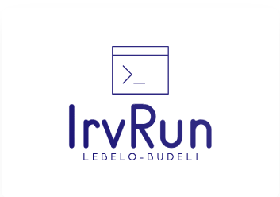

# IrvRun

**IrvRun** is a lightweight Visual Studio Code extension that lets you run MASM32 Assembly code using Irvine32 with a single click. It streamlines the workflow for writing, building, and executing `.asm` files, making Irvine32 development fast and easy, no manual setup required.

---

## Features

- **One-click run**: Instantly build and execute Irvine32 assembly files from VS Code.
- **Automatic build & run**: Uses `make32` and runs the resulting executable.
- **Irvine32 snippets**: Quickly insert common code patterns with built-in snippets.
- **Syntax highlighting**: Enhanced Irvine32 syntax support.
- **Works from editor or file explorer**: Run the current file or any `.asm` file from the explorer.
- **Output in integrated terminal**: See build and program output directly in VS Code.

---

## Usage

1. Open a `.asm` file in VS Code.
2. Press <kbd>Ctrl</kbd>+<kbd>Alt</kbd>+<kbd>N</kbd> or right-click and select **Run MASM Code**.
3. The extension will:
   - Change to the file’s directory
   - Run `make32 <filename>`
   - Execute the resulting program

### Snippets

Type a snippet prefix and press <kbd>Tab</kbd> to expand. Examples:

- `skeleton` — Basic MASM + Irvine32 program skeleton
- `writes` — Write a string using Irvine32
- `writei` — Write an integer
- `readi` — Read an integer
- `exit` — Exit program

See [src/snippets.json](src/snippets.json) for all available snippets.

---

## Configuration

You can customize extension settings in your VS Code `settings.json` under the `code-runner` section. See [src/utility.ts](src/utility.ts) for how configuration is loaded.

---

## Contributing

Pull requests and suggestions are welcome! Please open an issue or submit a PR.

---

## Backers

- Kamogelo Lebelo
- Budeli Thabelo

---

## License

MIT © 2017 Jun Han
